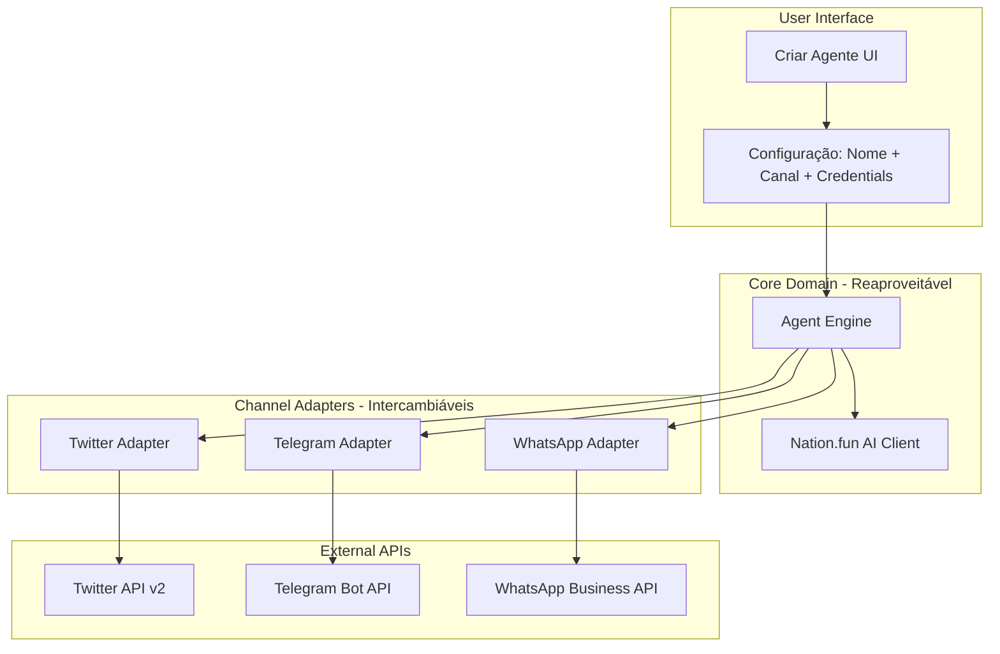

# Nation.fun - Arquitetura Channel Adapter

## 🎯 Visão Geral

**Princípio Fundamental:**  
`1 Agente = 1 Canal = Interface Unificada`

O **nation.fun** usa o padrão **Channel Adapter** para permitir que usuários criem agentes de IA conectados a diferentes canais de comunicação (WhatsApp, Twitter, Telegram) de forma simples e elegante.

---

## 🏛️ Arquitetura



---

## 📦 Estrutura de Diretórios

```
src/
├── lib/
│   ├── channels/              # Channel Adapters (intercambiáveis)
│   │   ├── base-channel-adapter.ts
│   │   ├── twitter-adapter.ts
│   │   ├── telegram-adapter.ts   # TODO
│   │   └── whatsapp-adapter.ts   # TODO
│   │
│   ├── core/                  # Lógica do Agente (reaproveitável)
│   │   ├── agent-engine.ts
│   │   ├── agent-factory.ts
│   │   └── nation-client.ts
│   │
│   └── utils/                 # Utilitários compartilhados
│       ├── logger.ts
│       ├── error-handler.ts
│       └── rate-limiter.ts
│
pages/api/agents/
├── [agentId]/
│   ├── start.ts               # POST - Iniciar agente
│   ├── stop.ts                # POST - Parar agente
│   └── status.ts              # GET - Status do agente
│
tests/
├── unit/
│   ├── channels/              # Testes de cada adapter
│   ├── core/                  # Testes do engine
│   └── utils/
└── integration/           # Testes E2E
```

---

## 🔧 Componentes

### 1. ChannelAdapter Interface

**Contrato unificado** que todos os canais devem implementar:

```typescript
export interface ChannelAdapter {
  listen(callback: (message: Message) => Promise<void>): Promise<void>;
  send(recipientId: string, text: string): Promise<void>;
  start(): Promise<void>;
  stop(): Promise<void>;
  readonly channelType: 'whatsapp' | 'twitter' | 'telegram';
}
```

### 2. AgentEngine

**Core reaproveitável** que:
- Recebe mensagens via adapter
- Processa com Nation.fun AI
- Envia respostas via adapter
- Trata erros de forma consistente

### 3. AgentFactory

**Factory Pattern** para:
- Criar agentes com canal específico
- Validar credenciais
- Instanciar adapter correto

---

## ✨ Benefícios

### 1. DRY (Don't Repeat Yourself)
✅ Lógica do agente escrita **uma vez**  
✅ Funciona automaticamente em **todos os canais**

### 2. SOLID
✅ **S**ingle Responsibility: Cada adapter cuida de um canal  
✅ **O**pen/Closed: Aberto para extensão, fechado para modificação  
✅ **L**iskov Substitution: Adapters são intercambiáveis  
✅ **I**nterface Segregation: Interface mínima e focada  
✅ **D**ependency Inversion: Core depende de abstrações

### 3. Testável
✅ Mocks fáceis para cada canal  
✅ Testes isolados por adapter  
✅ Core testado uma vez, vale para todos

### 4. Extensível
✅ Novo canal = **novo adapter**, zero impacto no core  
✅ Features cross-channel: implementa uma vez, funciona em todos

---

## 🚀 Como Usar

### Iniciar um Agente

```bash
curl -X POST http://localhost:3000/api/agents/my-bot/start \
  -H "Content-Type: application/json" \
  -d '{
    "agentId": "my-bot",
    "nationApiKey": "sua-chave-api",
    "channelType": "twitter",
    "channelCredentials": {
      "apiKey": "twitter-api-key",
      "apiSecret": "twitter-api-secret"
    }
  }'
```

**Resposta:**

```json
{
  "success": true,
  "message": "Agente my-bot iniciado com sucesso",
  "agentId": "my-bot",
  "channel": "twitter",
  "status": {
    "isRunning": true,
    "channelType": "twitter"
  }
}
```

### Parar um Agente

```bash
curl -X POST http://localhost:3000/api/agents/my-bot/stop
```

### Verificar Status

```bash
curl http://localhost:3000/api/agents/my-bot/status
```

---

## 📚 Guias

- **[Channel Adapter Guide](docs/CHANNEL_ADAPTER_GUIDE.md)** - Como adicionar novos canais
- **[Testing Guide](docs/TESTING_GUIDE.md)** - Como testar adapters  
- **[Deployment Guide](docs/DEPLOYMENT_GUIDE.md)** - Como fazer deploy

---

## 📈 Roadmap

### Fase 1: Base (Atual) ✅
- [x] Interface ChannelAdapter
- [x] AgentEngine core
- [x] TwitterAdapter (mock)
- [x] API endpoints
- [x] Testes unitários

### Fase 2: Twitter Real (Sprint 1) 🔵
- [ ] Integração com Twitter API v2
- [ ] Webhook implementation
- [ ] Rate limiting
- [ ] Retry mechanism

### Fase 3: Telegram (Sprint 2) 🔴
- [ ] TelegramAdapter completo
- [ ] Suporte a comandos
- [ ] Botões inline
- [ ] Envio de mídia

### Fase 4: WhatsApp (Sprint 3) 🔴
- [ ] WhatsAppAdapter
- [ ] QR Code authentication
- [ ] Gestão de sessão
- [ ] Reconexão automática

### Fase 5: Persistência (Sprint 4) 🔴
- [ ] Redis/Database
- [ ] Histórico de mensagens
- [ ] Métricas de performance
- [ ] Dashboard básico

---

## 🤝 Contribuindo

Veja nosso [guia de contribuição](CONTRIBUTING.md) para saber como adicionar novos canais ou melhorar a arquitetura.

---

## 📝 Licença

MIT License - veja [LICENSE](LICENSE) para detalhes.

---

**Construído com ❤️ pela comunidade Nation.fun**
