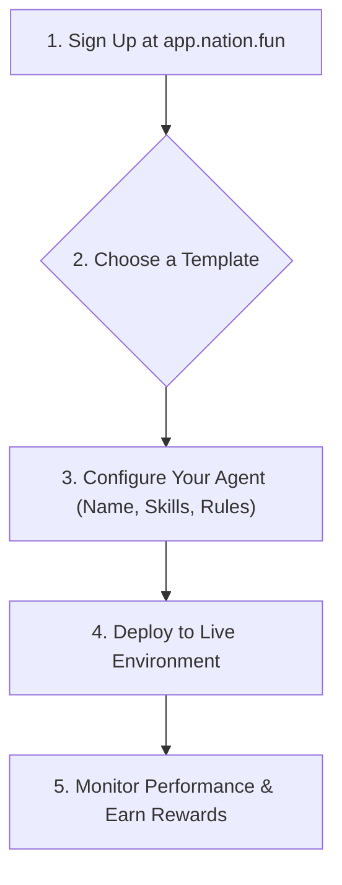
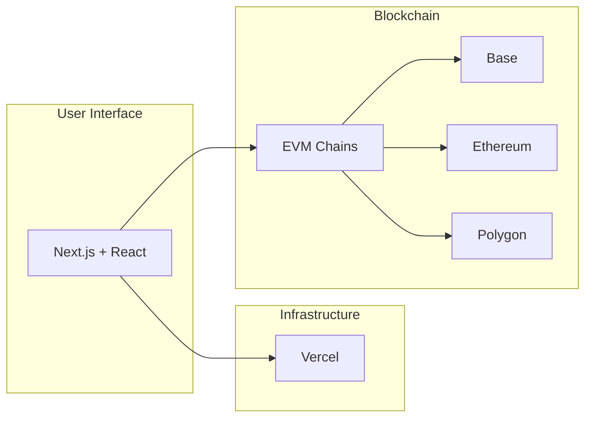

  

# 🌐 Nation.fun - Build AI Agents in Minutes

Site [vercel]: https://nationfun.vercel.app/
Doc [git pages]: https://govinda777.github.io/nation.fun/

> The easiest way to create, deploy, and monetize autonomous AI agents. No coding required.

## 🚀 What You Can Build

- **Social Media Bots** - Twitter, Telegram, Discord agents that engage your community
- **Trading Agents** - Autonomous crypto trading on blockchain
- **Notification Systems** - Smart alerts and notifications
- **Customer Support** - 24/7 automated customer service
- **Content Creation** - AI-powered content generators
- **Data Analysis** - Automated reporting and insights

## ⚡ Quick Start (5 minutes)

### 1. Sign Up
Visit [app.nation.fun](https://app.nation.fun) and create your account

### 2. Choose a Template
Select from pre-built agent templates or start from scratch

### 3. Configure Your Agent
- Name and personality
- Select skills (Twitter, Blockchain, APIs, etc.)
- Set parameters and rules

### 4. Deploy
One-click deployment to live environment

### 5. Monitor & Earn
Track performance and earn rewards

## ✨ Key Features

- 🎯 **No-Code Builder** - Drag-and-drop interface
- 🛠️ **Pre-built Skills** - Twitter, Telegram, Blockchain, HTTP APIs
- 💰 **Monetization** - Earn tokens from your agents
- 📊 **Analytics** - Real-time performance metrics
- 🔒 **Secure** - Enterprise-grade security
- 🌍 **Multi-chain** - Deploy on Base, Ethereum, Polygon
- 🤝 **Community** - Share and monetize your agents

## 🔗 Technology Stack

- **Frontend:** Next.js + React
- **Blockchain:** EVM-compatible chains (Base, Ethereum, Polygon)
- **Infrastructure:** Vercel

## 📖 Full Documentation

- [Getting Started Guide](./docs/getting-started.md)
- [Create Your First Agent](./docs/user-guides/first-agent.md)
- [API Reference](./docs/api/)
- [Best Practices](./docs/user-guides/best-practices.md)
- [Tutorials](./docs/tutorials/)

## 🤝 Community & Support

- **Website:** [nation.fun](https://nation.fun)
- **Discord:** [Join Community](https://discord.gg/nation)
- **Twitter:** [@nationfun](https://twitter.com/nationfun)
- **Email:** support@nation.fun
- **Docs:** [Full Documentation](https://docs.nation.fun)

## 🎓 Learn More

- [FAQ](./docs/reference/faq.md)
- [Success Stories](./CASE_STUDIES.md)
- [Blog](https://blog.nation.fun)
- [Webinars](https://nation.fun/webinars)

## 🤖 Example Agents

### Twitter Engagement Bot
Auto-reply to mentions, build community engagement

### Crypto Trading Bot
Monitor markets and execute trades 24/7

### Discord Moderator
Moderate your community automatically

## 🆓 Pricing

- **Free Tier:** 1 agent, 100 daily executions
- **Pro:** $9/month - 5 agents, unlimited executions
- **Enterprise:** Custom pricing for large deployments

[View full pricing →](https://nation.fun/pricing)

## 🤝 Contributing

We welcome contributions! See [CONTRIBUTING.md](./CONTRIBUTING.md)

## 📄 License

MIT License - see [LICENSE](./LICENSE)

## 🚀 Ready to Build?

[Start Creating →](https://app.nation.fun/signup)
